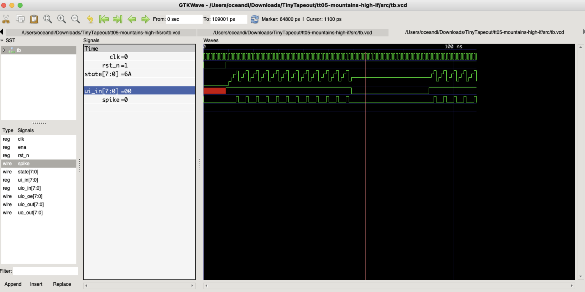
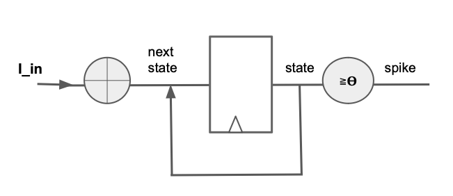

  

# How It Works?

The Tiny Tapeout Playground operates by applying an input current injection to the IF neuron using switches. The IF neuron model fires a spike when the input voltage crosses the specified threshold without considering any leakage. 
If the membrane potential exceeds the threshold, it triggers a spike.

## Simulations and Diagram

  

# What is Tiny Tapeout?

TinyTapeout is an educational project that aims to make it easier and cheaper than ever to get your digital designs manufactured on a real chip.

To learn more and get started, visit https://tinytapeout.com.

## Verilog Projects

Edit the [info.yaml](info.yaml) and uncomment the `source_files` and `top_module` properties, and change the value of `language` to "Verilog". Add your Verilog files to the `src` folder, and list them in the `source_files` property.

The GitHub action will automatically build the ASIC files using [OpenLane](https://www.zerotoasiccourse.com/terminology/openlane/).

## How to enable the GitHub actions to build the ASIC files

Please see the instructions for:

- [Enabling GitHub Actions](https://tinytapeout.com/faq/#when-i-commit-my-change-the-gds-action-isnt-running)
- [Enabling GitHub Pages](https://tinytapeout.com/faq/#my-github-action-is-failing-on-the-pages-part)

## Resources

- [FAQ](https://tinytapeout.com/faq/)
- [Digital design lessons](https://tinytapeout.com/digital_design/)
- [Learn how semiconductors work](https://tinytapeout.com/siliwiz/)
- [Join the community](https://discord.gg/rPK2nSjxy8)

## What next?

- Submit your design to the next shuttle [on the website](https://tinytapeout.com/#submit-your-design). The closing date is **November 4th**.
- Edit this [README](README.md) and explain your design, how it works, and how to test it.
- Share your GDS on your social network of choice, tagging it #tinytapeout and linking Matt's profile:
  - LinkedIn [#tinytapeout](https://www.linkedin.com/search/results/content/?keywords=%23tinytapeout) [matt-venn](https://www.linkedin.com/in/matt-venn/)
  - Mastodon [#tinytapeout](https://chaos.social/tags/tinytapeout) [@matthewvenn](https://chaos.social/@matthewvenn)
  - Twitter [#tinytapeout](https://twitter.com/hashtag/tinytapeout?src=hashtag_click) [@matthewvenn](https://twitter.com/matthewvenn)
